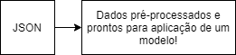
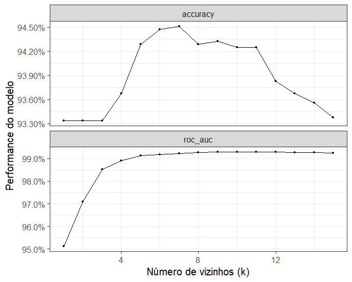

# Introdução 


O _deploy_ de Modelos de Machine Learning é chato!

--

- As dependências são numerosas e normalmente não são muito comuns (*keras* e *torch* para _Deep Learning_, *cuda* para uso de _GPU_ (placa de vído), bibliotecas de algebra linear etc)

--

- Existem muitos frameworks e produtos voltados para isso, como _SageMaker_ da AWS e _DataBricks_ 

--

- As rotinas de pré-processamento precisam receber muito carinho.

--

- Quem poderá nos socorrer?

--

```{r, echo = FALSE, out.width='50%'}
knitr::include_graphics("https://raw.githubusercontent.com/matthewfeickert/talk-IML-workshop-2019/master/figures/Docker_nyan_whale.gif")
```

---

# Ideia geral

Hoje vamos implementar um fluxo _end-to-end_ de Machine Learning em R sem sofrer!

**1.** Treinar um modelo de classificação a partir dos vizinhos mais próximos (também conhecido como K-Nearest Neighbor(KNN));

**2.** Disponibilizar ums serviço online que disponibiliza o nosso modelo para qualquer pessoa ou aplicação que precise consulta-lo.

--

Nosso modelo inclusive já vai aplicar uma série de pré-processamentos nesses dados.

```{r, echo = FALSE, out.width="40%"}

```

---

# O modelo KNN

```{r, echo = FALSE, out.width = "90%"}
knitr::include_graphics("https://miro.medium.com/max/1506/0*jqxx3-dJqFjXD6FA")
```


---

# Detalhamento API

Uma parte importante do que vamos fazer hoje será construir **sem sofrer** uma API que execute os seguintes passos:

**1.** Recebe um JSON em formato pré-definido:

```{json}
{
  # dados biometricos de algumas plantas
  # nosso modelo vai dizer a qual espécie uma planta
  # com essas medidas pertence
  "Sepal.Length":5.1,
  "Sepal.Width":3.5,
  "Petal.Length":1.4,
  "Petal.Width":0.2,
}
```

--

**2.** Execute uma série de rotinas de pré-processamento nesses dados.

```{r, echo = FALSE, out.width="40%"}

```

---

# Ideia geral

E por fim...

**3.** Retorne um JSON com o resultado de um modelo preditivo:

```{json}
{
  "Sepal.Length":5.1,
  "Sepal.Width":3.5,
  "Petal.Length":1.4,
  "Petal.Width":0.2,
  # AQUI VAI UM EXEMPLO, MAS PODE SER O QUE VOCÊ QUISER:
  "especie_mais_provavel": "Setosa"
}
```

---

# O pulo do gato

`tidymodels` é uma meta-biblioteca da linguagem R que te permite especificar de maneira compartimentada todos os passos do workflow da construção de um modelo

**1.** Execução de rotinas de pré-processamento 

--

**2.** Ajuste de hiperparâmetros por reamostragem/validação cruzada, com recalculo do pré-processamento nas oportunidades adequadas

--

**3.** Ajuste do modelo final e solifidicação das regras de pré-processamento com relação à base completa

---

# Criando uma receita de pré-processamento

Uma rotina não é mais do que uma sequência de passos, que pode ser declarada numa interface amigável e depois exportado para um objeto `receita.rds`

--

```{r, echo = TRUE, eval = FALSE}

receita <- recipe(
  Species ~ .,
  # formula do nosso modelo. à esquerda do ~ temos a variável
  # resposta e à direita as nossas covariáveis. O "." indica que
  # tudo que não é "Species" vai ser usado para prever
  data = iris) %>% 
  # iris é o nosso banco de dados de flores
  step_normalize(all_numeric()) %>%
  # esse passo vai deixar todas as variáveis númericas
  # dos dados sem escala
  step_medianimpute(all_numeric())
  # esse passo vai inserir a mediana das colunas caso encontra
  # alguma informação faltante

# para que a gente consiga usar os dados depois,
# basta salvar essa receita:

saveRDS(prep(receita, iris), "receita.rds")
  
```

---

# Ajustando um modelo KNN | Escolhendo o melhor k

```{r, echo = TRUE, eval = FALSE}

modelo_knn <- nearest_neighbor(neighbors = tune()) %>% 
  set_engine("kknn") %>% 
  set_mode("classification") %>% 
  translate()

reamostra_vizinhos <- workflow() %>% 
  add_recipe(receita) %>% 
  add_model(modelo_knn) %>% 
  tune_grid(resamples = mc_cv(iris, .3),
            grid = 60)

```

---

# Ajustando um modelo KNN | Escolhendo o melhor k

```{r, eval = FALSE}
reamostra_vizinhos %>% 
  autoplot()
```

```{r, echo = FALSE, out.width="65%", fig.align="center"}

```

---

# Ajustando o modelo final

```{r, echo = TRUE, eval = FALSE}
modelo_final <- workflow() %>% 
  add_recipe(receita) %>% 
  add_model(
    finalize_model(
      modelo_knn, 
      select_best(
        reamostra_vizinhos, 
        "accuracy"
      )
    )
  ) %>% 
  fit(iris)

# salvando para que a gente consiga usar no R
saveRDS(modelo_final, "modelo_final.rds")
```

---

# Disponibilizando a API

Agora basta usar os arquivos criados em um script `api.R` que segue uma leve formatação

```{r, eval = FALSE}
#* Gera a previsão em cima de um conjunto de dados
#* @post /gera_previsao 
getprediction <- function(req) {
  example <- jsonlite::fromJSON(req$postBody)
  
  modelo_final <- readRDS(path = "modelo_final.rds")
  receita <- readRDS(path = "receita.rds")
  prediction <- predict(
    modelo_final,
    new_data = bake(receita, parsed_example))

  dplyr::bind_cols(parsed_example, prediction)
}
```

Para liberar a API, basta fazer:

```{r, eval = FALSE}
r <- plumber::plumb("api.R")
r$run(port = 80)
```

---

# Escrevendo o Dockerfile

No fim, basta construir um dockerfile que execute esse script

```{docker}
FROM rocker/tidyverse

RUN apt-get update -qq && apt-get install -y \
  git-core \
  libssl-dev \
  curl \
  libsodium-dev \
  libxml2-dev

COPY ./ /tmp/api/

RUN R -e "install.packages('plumber')"
RUN R -e "install.packages('tidymodels')"

EXPOSE 80

CMD ["Rscript", "-e", 
      "pr <- plumber::plumb('api.R');
       pr$run(host= '0.0.0.0', port=80, swagger = TRUE)"
     ]
```

---

# Conclusão

- Docker simplifica muito a vida e abstrai todos os problemas que a gente pode acabar tendo quando coloca modelos em produção.

-- 

- Os pacotes do `tidymodels` oferecem um jeito de construir modelos de _machine learning_ que se integra naturalmente com o que será necessário fazer no ambiente de produção.

-- 

- Mesmo usando outras soluções de _deploy_ de modelos de machine learning integrar imagens _docker_ 

---
